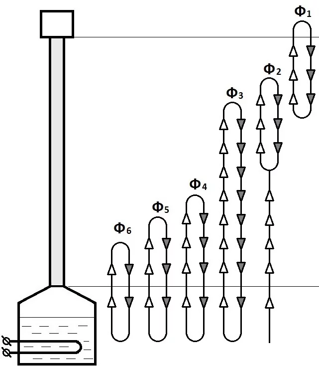

# Rectify - полуавтомат для ректификации
прототип устройства для упрощения процесса ректификации спирта-сырца.

1. [Roadmap](#Roadmap)
2. [Hardware](#Hardware)
3. [Software](#Software)
4. [Техпроцесс](#Техпроцесс)

# Roadmap
## Что MVP должен делать:
* замерять температуру в зоне отбора
* непрерывно выводить информацию о текущей температуре
* управлять скоростью отбора посредством серво
* выводить отладочную информацию на дисплей
* обеспечить возможность с помощью энкодера корректировать режим
* с помощью буззера привлекать внимание оператора, когда это необходимо

## Что полуавтомат ПОКА не должен делать (выполняется оператором):
* следить за температурой в кубе (термометр не подключен)
* следить за количеством отобранной жидкости (нет датчиков и механики, не актуально для MVP)
* следить за тем, куда ведется отбор (нет механизма, не актуально для MVP)
* контроллировать охлаждение (нет механизма)
* контроллировать нагрев (нет механизма)
* контроллировать протечки (не актуально для MVP)
* иметь меню режимов (не актуально для MVP)
* иметь возжможность использования не только для ректификации (нет механики)
* иметь беспроводное управление (не актуально для MVP)
* иметь съемную, герметичную плату управления с разъемами для периферии (не актуально для MVP)

# Hardware

Общий вид | Плата укрупненно
------ | ------
 | 

В основе устройства лежит плата расширения для Arduino Mega 5x8_v1 by Indestroom (прототип) и узел отбора для ректификата от СанСаныча Самогонщикова (модифицированный).
Плата имеет питание 12в, с понижением до 5/3.3 вольт для периферии. 

## Текущая распиновка
* сервомотор: 
	- 30
* buzzer: 
	- 24
* термометр DS18B20:
	- 25
* энкодер:
	- CLK 19
	- DT 18
	- BTN 27
* дисплей TM1637:
	- CLK 52
	- DIO 10
* дисплей LCD 4x20 i2c:
	- SDA 20
	- SCL 21

# Software
пока предполагается разработка в рамках [PlatformIO](https://platformio.org/ "PlatformIO - professional collaborative platform for embedded development")

# Техпроцесс
## Суть процесса ректификации

Процесс ректификации | Распределение фракций
------ | ------
 | 

ректификация заключается в том, что в колонне за счет постоянного нагрева и охлаждения обеспечивается непрервный и равновесный процесс тепло-массо-обмена. При таком подходе, в достаточно высокой колонне (около 1 м реальной высоты, за счет структурного наполнителя приведенная высота в разы больше) фракции (вещестав с разной температурой кипения) располагаются на разной высоте: более летучие выше, более тяжелые ниже. Тем самым, по немногу (чтобы не нарушить равновесие) отбирая вещество из вехней точки колонны, мы можем быть уверены что отбираем самую легкую из имеющихся фракций, а зная температуру в этой точке, можем таже определить, что это за вещество или группа веществ.  
Из-за того, что в процессе отбора важно не нарушить равновесие массообмена, процесс происходит очень долго - поэтому возникла потребность хотя бы в частичной автоматизаци процесса.

## этапы процесса для устройства
0. Инициализация
    * примитивный селф-чек
    * определение, на каком этапе находимся
    * с помощью серво мы закрываем вентиль (_угол определяется конфигом_)
1. Преднагрев
    * процесс нагрева уже запущен, но испарение еще не началось. Температура неизменна или медленно растет.
    * этап заканчивается, когда температура превышает некую целевую или резко растет (_определяется конфигом_), пищит бузер, привлекая оператора.
2. Нагрев 
    * процесс нагрева продолжается, идет испарение наименее легких фракций, которые при этом прогревают колонну. В этот момент уже должно работать охлаждение, а мощность нагревателя чуть убавлена (мощность охлаждения должна быть примерно равна мощности нагрева)
    * этап заканчивается, когда температура фиксируется на определнной отметке в районе 76-80 градусов (_определяется конфигом_) и остается неизменной с точностью до 0.5 градуса (пока не точно, _определяется конфигом_) не менее 30 минут (_определяется конфигом_)
3. Отбор голов
    * после того, как колонна постояла достаточно долго при неизменной температуре (вышла в равновесный режим), мы начинаем отбор наиболее летучих фракций (голов), состоящих из ацетона, метила и т.д.
    * с помощью серво мы приоткрываем вентиль на угол малого отбора (_определяется конфигом_), температура при этом начинает медленно расти.
    * этап заканчивается, когда оператор зафиксирует, что головы отобраны полностью (есть ожидаемый объем, но окончательное решение принимается по запаху жидкости)
4. Технологическая пауза
    * после завешнения отбора голов закрывается отбор с помощью серво, и выдерживается пауза в 15 минут (_определяется конфигом_)
    * в этот момент нужно также зафиксировать в памяти текущую температуру (в отладочных целях)
5. Отбор спирта
    * после отбора голов и технологической паузы, мы начинаем отбор спиртовой фракци, отрывая узел отбора с помощью серво на угол основного отбора (_определяется конфигом_)
    * спустя некоторое время в данном режиме, температура установится на некой температуре (должна коррелировать с температурой, полученной в предыдущем пункте). Эту температуру мы считаем целевой.
    * при повышении фактической температуры хотя бы на (разрешение термометра x2, не более 0.5) градуса нужно закрыть отбор - это говорит о нарушении массообмена, то есть о поднятии более тяжелых фракций.
    * если после закрытия отбора, температура спустя некоторое время снова падает, мы снова открываем отбор, и снова ждем превышение целевой температуры
    * если после закрытия отбора, температура больше не падает, нужно привлечь внимание оператора - будет либо исправлен режим (возможно, не хватает мощности охлаждения/избыточный нагрев), либо процесс будет прекращен/переведен в следующий этап.
6. *Отбор хвостов (опциональный)
    * питьевой спирт уже отобран, но в перегонном кубе еще остаются тяжелые спирты (в т.ч. ароматные). Иногда их нужно также собрать, но в отдельную емкость.
    * открываем узел отбора с помощью серво на угол основного отбора (_определяется конфигом_) и не закрываем до достижения тепературы в 99.8 градусов (_определяется конфигом_)

*Все ошибки в процессе на данный момент обрабатываются в виде закрытия отбора и привлечения внимания оператора.*
